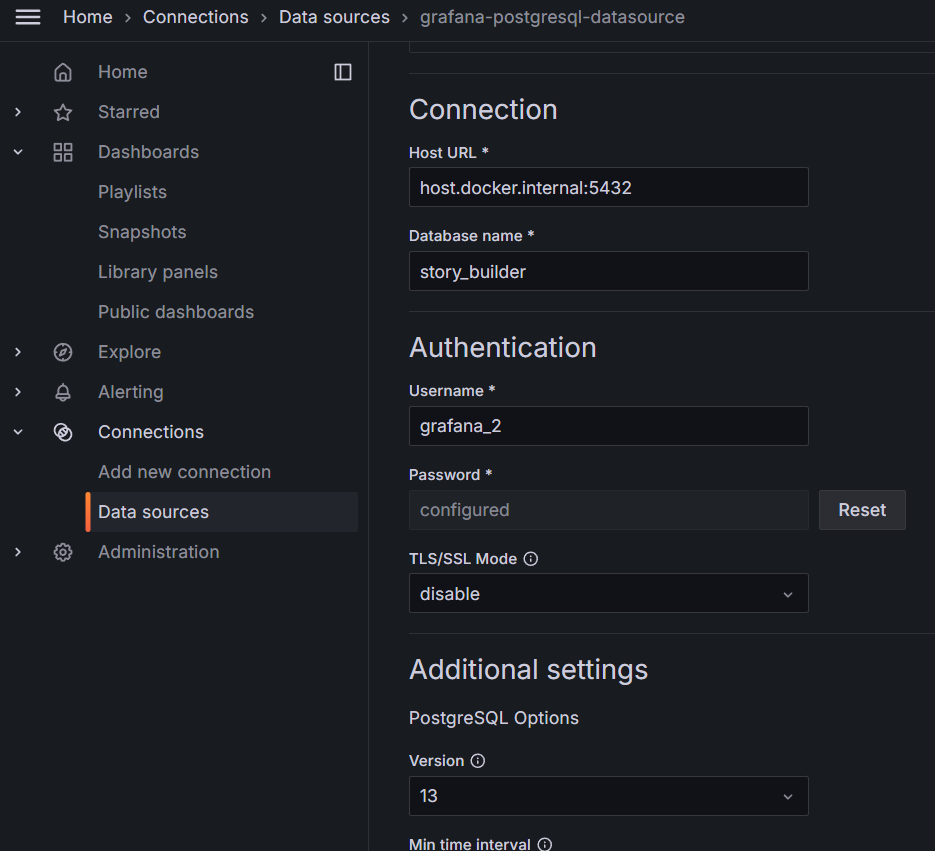
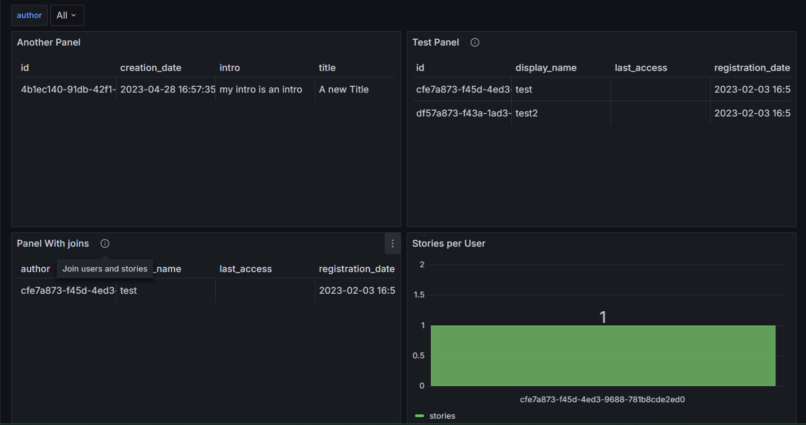

# Grafana + Postgres

A project to experiment with connecting a Grafana dashbaord to a postgres database.

## What I did

- Used Grafana enterprise docker image to run Grafana locally.
  I added a volume to the container for persistance.

```
docker run -d -p 3000:3000 --name=grafana --volume grafana-storage:/var/lib/grafana grafana/grafana-enterprise
```

**src**: https://grafana.com/docs/grafana/latest/setup-grafana/installation/docker/

- Using one of my existing databases, called _story_builder_, I added a read-only user. A read only user is a user who is only able to connect to database and execute SELECT statements.
  Following SQL commands create a user with username 'grafana_2' and password 'grafana'

```SQL
CREATE ROLE grafana_2 WITH
	LOGIN PASSWORD 'grafana';
GRANT USAGE ON SCHEMA public TO grafana_2;
GRANT SELECT ON ALL TABLES IN SCHEMA public TO grafana_2;
ALTER DEFAULT PRIVILEGES IN SCHEMA public GRANT SELECT ON TABLES TO grafana_2;
```

**src**: https://stackoverflow.com/a/42044878

- I created a postgres connection to Grafana. Here are the parameters.
  

- I created a dashboard with some panels, you can import it by using the `dashboard.json` file in the root folder of this repo.
  Here is how it looks like
  
- To allow users to filter dashboard by `author`, I did the following:
  - Created a variable by going to Dashboard settings -> Variables and filled the parameters (you can check it in the imported dashboard using `dashboard.json`).
  - Made my panel queries dynamic by using `$author` variable, here is an example:
  ```SQL
  SELECT id, display_name, last_access, registration_date FROM users WHERE id IN ( $author  )
  ```
