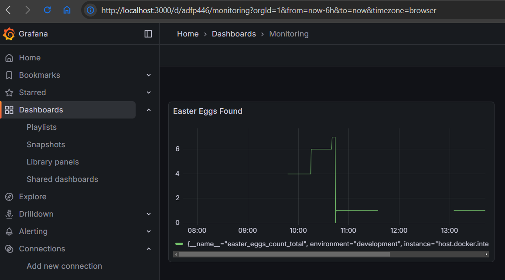

# Spring Boot + Prometheus + Grafana
A project to experiment with monitoring spring boot application
using Prometheus. Additionally, Grafana is added for visualization.

## What I did
### Spring Boot
- Created a spring project using https://start.spring.io/, and added the following
dependencies:
  - Spring web
  - Spring actuator
  - Prometheus
- Added a custom metric called `easter_eggs_count`.
- Added `/easter-egg` endpoint, which increments the custom metric.

### Prometheus
- Created `prometheus.yml` file containing the configuration.
- Created `Dockerfile` to build prometheus image and copy `prometheus.yml` to container.

To build the image:
```
cd prometheus
docker build -t prometheus-spring-boot . 
```

To run a container:
```
docker run -p 9090:9090 prometheus-spring-boot
```
After starting the spring boot app and prometheus container,
do some calls to `/easter-egg` endpoint.
You should then be able to see changes in prometheus within 15 seconds.


### Grafana
1. Pulled Grafana image and ran a container.
2. Added Prometheus datasource and created a panel to view the `easter_eggs_count` metric.
3. Exported the dashboard into `dashboard.json`.
4. Exported the datasource using the command
```
curl -u admin:admin http://localhost:3000/api/datasources
```
5. Converted the output to yaml and pasted it into `datasources.yaml`
6. Created `Dockerfile` which copies json and yaml files to Grafana container.

To build the image:
```
cd grafana
docker build -t grafana-spring-monitoring .
```

To run a container:
```
docker run -p 3000:3000 grafana-spring-monitoring
```

You should be able to see the `easter_eggs_count` metric.
